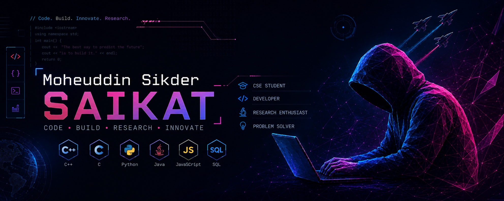

  

#  ɪ'ᴍ Moheuddin Sikder SAIKAT!  
*Aspiring Software Developer | CS Student | Research enthusiast*
  

I am a Computer Science student at United International University (UIU), currently learning programming from the ground up. I am exploring various technologies, including Java, C++, HTML, XML, CSS, JavaScript, PHP, and SQL. My main interests are in web development, software engineering, and databases. I enjoy building practical projects and experimenting with different ideas. Some of my projects include StudyFlow, UIU Companion, semester fee calculators, academic tools, and productivity-focused applications.

- ✨ Passionate about learning and growing as a developer.
- 🌱 Currently improving my understanding of programming fundamentals.
- 💻 Exploring different programming languages and problem-solving techniques.
- ✍ Interested in open-source contributions and real-world projects.
- 🚀 Excited to apply my knowledge and build new things step by step.
- 📜 Looking to connect and collaborate with other learners!

  

---
<h2 align="center">Tᴇᴄʜ Sᴛᴀᴄᴋ & Cᴜʀʀᴇɴᴛ Lᴇᴀʀɴɪɴɢ</h2> 
<picture>
  <source media="(prefers-color-scheme: dark)" srcset="./Skills_Animation_Dark.gif">
  <source media="(prefers-color-scheme: light)" srcset="./Skills_Animation_White.gif">
  
</picture>
 

<h3 align="left">Current Learning</h3>
<ul align="left">
  <li>Learning the basics of programming and software development.</li>
  <li>Exploring C++, PHP, Java, and web technologies step by step.</li>
  <li>Practicing problem-solving and improving coding logic.</li>
</ul>

<h3 align="left">Goals</h3>
<ul align="left">
  <li>Gain confidence in coding and build simple projects.</li>
  <li>Understand web development and backend technologies.</li>
  <li>Keep learning and improving through practice.</li>
</ul>

  <a href="https://github.com/Mohiuddin0035">
    <picture>
      <source media="(prefers-color-scheme: dark)" srcset="https://user-images.githubusercontent.com/6661165/113709167-2412f500-971d-11eb-9ee5-0ab292cf8b4c.png">
      <source media="(prefers-color-scheme: light)" srcset="https://user-images.githubusercontent.com/6661165/113709167-2412f500-971d-11eb-9ee5-0ab292cf8b4c.png">
      
    </picture>
  </a>

<h2 align="center">📊 Gɪᴛʜᴜʙ Sᴛᴀᴛs 📊</h2>

<table width="100%">
  <tr>
    <td width="50%">
      <h3 align="center"><strong>Gɪᴛʜᴜʙ Sᴛᴀᴛs</strong></h3>
      

        
      

    </td>
    <td width="50%">
      <h3 align="center"><strong>Sᴛʀᴇᴀᴋ Sᴛᴀᴛs</strong></h3>
      

        
      

    </td>
  </tr>
  <tr>
    <td width="50%">
      <h3 align="center"><strong>Lᴀᴛᴇsᴛ Pʀᴏᴊᴇᴄᴛ</strong></h3>
      

        
      

    </td>
    <td width="50%">
      <h3 align="center"><strong>Tᴏᴘ Cᴏɴᴛʀɪʙᴜᴛɪᴏɴs</strong></h3>
      

        
      

    </td>
  </tr>
</table>
 

<h2 align="center">📈 Cᴏɴᴛʀɪʙᴜᴛɪᴏɴ Gʀᴀᴘʜ 📈</h2>

    

---

<h2 align="center">🌟 Tʜᴏᴜɢʜᴛ ᴏғ ᴛʜᴇ Dᴀʏ 🌟</h2>

    

    

<h2 align="center">🤝 Cᴏɴɴᴇᴄᴛ Wɪᴛʜ Mᴇ 🤝 </h2>

  
      

 

  

